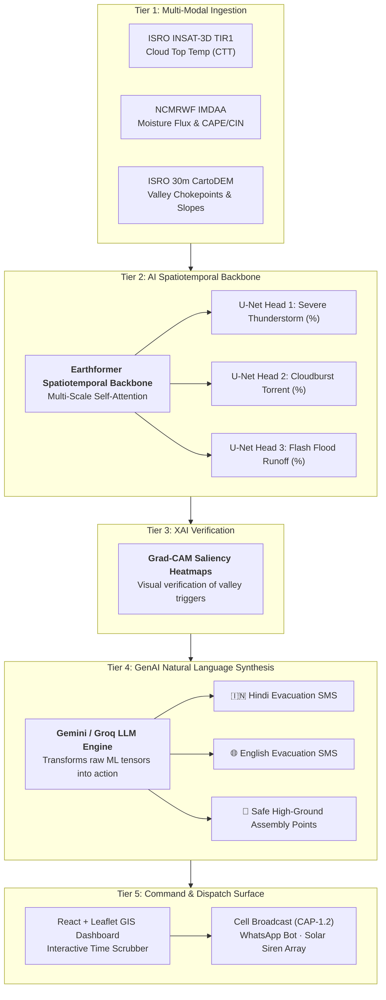

# Ethrix-Nowcast ⚡⛈️

**AI-Driven Hyper-Local Weather & Cloudburst Early Warning System (2–6h Lead Time)**  
*Smart India Hackathon (SIH 2026) · Problem Statement ID: 26077*

[](https://sih.gov.in)
[](#)
[](#)
[](#)

---

## 📌 1. Problem Statement & Context (Problem ID: 26077)

**Goal:** Develop an AI-driven hyper-local early warning system for extreme weather events (Cloudbursts, Flash Floods, Severe Thunderstorms) with a **2–6 hour lead time** across vulnerable mountain catchments.

### The Mountain Challenge:
Traditional Doppler Weather Radar (DWR) systems suffer from severe beam blockage in high Himalayan and North-Eastern valleys. Furthermore, traditional Numerical Weather Prediction (NWP) runs require 3–6 hours of compute time—too slow for sudden convective cloudbursts.

**Ethrix-Nowcast** bridges this gap by combining:
1. Satellite Thermal Dynamics (ISRO INSAT-3D TIR1 half-hourly cloud top cooling).
2. Atmospheric Instability & Moisture Influx (NCMRWF IMDAA Reanalysis).
3. High-Resolution Digital Elevation Models (ISRO 30m CartoDEM orographic choke points).
4. Spatiotemporal Neural Transformers (**Earthformer**) for sub-4-second inference.
5. Explainable AI (**Grad-CAM**) for decision transparency.
6. GenAI Natural Language Synthesis (**Gemini / Groq LLMs**) for automated bilingual evacuation alerts.

---

## 🏗️ 2. The 5-Tier Architecture



- **Tier 1 (Data):** ISRO INSAT-3D (Satellite TIR1 CTT), NCMRWF IMDAA (Atmospheric Moisture Flux Convergence), ISRO CartoDEM (30m Valley Topography).
- **Tier 2 (AI Brain):** Earthformer (Spatiotemporal Backbone) with 3 simultaneous prediction heads:
  - ⛈️ **Cloudburst Probability (%)**
  - 🌊 **Flash Flood Runoff (%)**
  - ⚡ **Severe Thunderstorm (%)**
- **Tier 3 (Verification / XAI):** Grad-CAM saliency heatmaps highlighting atmospheric triggers & valley bottlenecks to eliminate false alarms.
- **Tier 4 (GenAI):** Gemini/Groq LLM generating natural language bilingual (Hindi & English) evacuation SMS alerts with safe assembly zones.
- **Tier 5 (Action):** GIS Command Dashboard with historical time scrubber, interactive atmospheric layers, and multi-channel siren triggers.

---

## ⚡ 3. Key Interactive Prototype Features (Screening Phase)

For the SIH online screening phase (PPT submission), the prototype is primed with a high-fidelity client-side interactive simulation representing the **August 2023 Kangra & Beas Valley Cloudburst Event**:

### ⏱️ 1. Interactive Time Slider (The "Wow" Factor)
- Scrub through **6 sequential time steps** of a historical extreme event:
  - `T-4h` (14:00 IST) — Baseline Atmospheric Preconditioning (CAPE: 1,250 J/kg, CTT: -32°C)
  - `T-3h` (15:00 IST) — Convective Initiation & Updraft (CAPE: 1,950 J/kg, CTT: -46°C)
  - `T-2h` (16:00 IST) — Mesoscale Convective Deepening (CAPE: 2,550 J/kg, Radar: 48 dBZ)
  - `T-1h` (17:00 IST) — **Rapid Cloud-Top Cooling Alert** (CTT: -68°C, Prob: 88%)
  - `T0` (17:45 IST) — **Catastrophic Cloudburst Nowcast Event** (Rainfall: 114 mm/h, Prob: 96%)
  - `T+1h` (18:45 IST) — Debris Flow & Flash Flood Runoff Peak
- **Dynamic Grad-CAM Evolution:** As you scrub, concentric red/orange heatmaps expand and intensify over the target valley.

### 🧠 2. Tier-3 Grad-CAM Explainable AI (XAI) Panel
- Click any catchment hotspot on the map or click **"Tier-3 Grad-CAM (XAI)"** to view:
  - Multi-Head U-Net probabilities (Cloudburst 88%, Flash Flood 91%, Thunderstorm 98%).
  - Primary physical triggers (Rapid CTT cooling of -16°C in 25 min + Dhauladhar orographic blocking).
  - Feature weight attributions:
    - `INSAT-3D TIR1 CTT`: **38%** (+3.4σ anomaly)
    - `NCMRWF IMDAA Moisture`: **29%** (+2.9σ anomaly)
    - `ISRO CartoDEM Valley Funnel`: **21%** (Gorge throat 46°)
    - `IMD Doppler Radar`: **12%** (55 dBZ hail core)

### 📲 3. Tier-4 GenAI Bilingual Alert Modal ("Dispatch AI Alert")
- Click **"Dispatch AI Alert (Tier 4 LLM)"** to inspect pre-generated natural language evacuation SMS:
  - **🇮🇳 Hindi SMS Preview:**
    > *"🚨 अति आवश्यक बादल फटने की चेतावनी (NDMA / Ethrix-Nowcast): अगले 45 मिनटों में भागसू नाग / धर्मशाला घाटी में भीषण बादल फटने (Cloudburst) और फ्लैश फ्लड की 88% संभावना है। कृपया नदी तट और निचले ढलानों से तुरंत ऊंचे सुरक्षित स्थानों (शेल्टर बी - कम्युनिटी हॉल) पर जाएं। हेल्पलाइन: 1077 / 112."*
  - **🌐 English SMS Preview:**
    > *"🚨 URGENT CLOUDBURST WARNING (NDMA / Ethrix-Nowcast): Ethrix AI models predict 88% probability of imminent cloudburst & flash flood in Bhagsu Nag / Dharamshala within 45 mins. IMMEDIATELY EVACUATE low nullahs to designated high shelters (Shelter B). Helpline: 1077 / 112."*
  - **⚙️ JSON Prompt & Payload:** Full transparent LLM input/output schema.

### 📊 4. Atmospheric Metrics & Legends
- Replaces generic slope markers with atmospheric indicators:
  - **Cloud Top Temp (CTT):** `-28°C` to `-74°C` (INSAT-3D TIR1)
  - **Surface CAPE:** `J/kg` (Convective Available Potential Energy)
  - **CIN:** `J/kg` (Convective Inhibition capping barrier)
  - **Doppler Radar:** `dBZ` (Precipitation reflectivity core)
  - **Precip Intensity:** `mm/h` instant rate
  - **Threshold Legends:** Advisory (CAPE < 1500) $\rightarrow$ Watch (CAPE 1500–2200) $\rightarrow$ Warning (Radar > 45 dBZ) $\rightarrow$ Critical Cloudburst (88%+).

### ⚡ 5. Frictionless Judge Demo Access
- **1-Click Judge Access:** Evaluators scanning the QR code in the PPT can bypass login forms via the **"⚡ Launch Interactive Judge Demo"** button on the Landing and Login pages.

---

## 📁 Repository Structure

```
SIH/
├── geoalert-ner-dashboard/           # Main Production Web Dashboard
│   ├── client/
│   │   ├── index.html                # App entrypoint (Ethrix-Nowcast metadata)
│   │   └── src/
│   │       ├── components/
│   │       │   ├── NowcastTimeSlider.tsx   # Interactive historical simulation scrubber
│   │       │   ├── XaiRiskPanel.tsx        # Tier-3 Grad-CAM Explainable AI drawer
│   │       │   ├── LlmAlertModal.tsx       # Tier-4 GenAI bilingual SMS alert modal
│   │       │   ├── GeoRiskMap.tsx          # Leaflet GIS map with dynamic Grad-CAM heatmaps
│   │       │   ├── DashboardLayout.tsx     # Command sidebar with 1-click Judge Demo access
│   │       │   ├── TrendCharts.tsx         # Multi-metric dual axis charts
│   │       │   └── SensorNodeAnalytics.tsx # Sensor telemetry analytics
│   │       ├── lib/
│   │       │   ├── nowcastData.ts          # 6-step historical cloudburst dataset
│   │       │   └── districtsData.ts        # Valley & catchment metadata
│   │       ├── pages/
│   │       │   ├── Home.tsx                # Landing page with 5-Tier architecture pitch
│   │       │   ├── DashboardPage.tsx       # Main command console with time scrubber
│   │       │   ├── MapViewPage.tsx         # Full-screen GIS map view
│   │       │   ├── HistoryPage.tsx         # Historical cloudburst audit logs
│   │       │   └── BroadcastsPage.tsx      # Emergency siren & broadcast history
│   │       ├── index.css                   # Glassmorphism design system & GIS marker styles
│   │       └── App.tsx                     # Wouter router
│   ├── package.json
│   └── vite.config.ts
│
├── backend/                          # FastAPI Backend Architecture (For Finale Phase)
│   └── ...
├── changes.md                        # Problem statement transition brief
└── README.md                         # Project documentation
```

---

## 🚀 Quickstart & Developer Setup

### Prerequisites
- **Node.js 18+** & **npm** / **pnpm**
- **Git**

### Step 1: Clone & Switch to the `ethrix-nowcast` Branch
```bash
git clone https://github.com/Shantanu-Pathak-1/SIH-Porject.git
cd SIH-Porject
git checkout ethrix-nowcast
```

### Step 2: Install Frontend Dependencies
```bash
cd geoalert-ner-dashboard
npm install
```

### Step 3: Start Vite Dev Server
```bash
npm run dev
```

Open your browser at:
```text
http://localhost:5173
```

### Step 4: Build for Production (Vercel Deployment)
```bash
npm run build
```
*(Transformed 1,805 modules in 18s with 0 errors).*

---

## 🎯 How Evaluators / Judges Should Test the Prototype

1. **Scan the PPT QR Code** or open `http://localhost:5173`.
2. On the landing page, click **"⚡ Launch Live Prototype (Judge Access)"**.
3. In the command console:
   - **Scrub the Time Slider:** Click **"T0 Cloudburst Peak"** to observe the instant transition to critical danger, with concentric crimson Grad-CAM heatmaps over Bhagsu/Kangra valley.
   - **Inspect XAI:** Click **"Tier-3 Grad-CAM (XAI)"** to view the physical triggers (rapid CTT cooling, CAPE surge, CartoDEM valley funneling).
   - **Dispatch AI Alert:** Click **"Dispatch AI Alert (Tier 4 LLM)"** to review the bilingual Hindi & English evacuation SMS.
   - **Simulate Broadcast:** Click **"Simulate AI Broadcast to All Channels"** to trigger sound sirens and log the emergency dispatch.

---

## 🏆 Smart India Hackathon (SIH 2026) Submission Details
- **Team Project Name:** Ethrix-Nowcast
- **Problem Statement ID:** 26077
- **Category:** Software
- **Domain:** Disaster Management / AI & Climate-Tech
